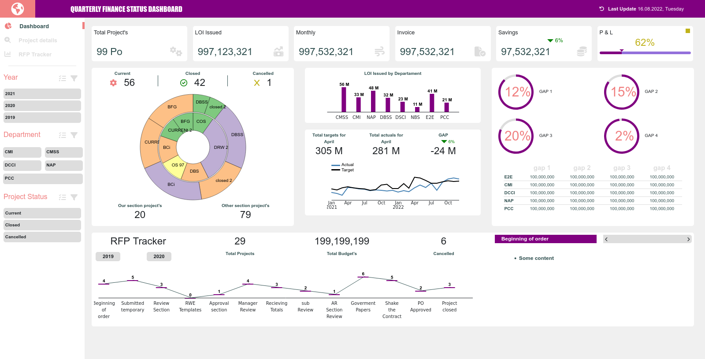

# Dashboard template.
Html + css template that could be used as a admin. or finance dashboard. 
[DEMO LINK](https://eugenelapanik.com/dashboard/)

## Description
This dashboard is a frontend project. The main aim was practicing my skill of work with 3d.js library. I've found that the best way to practice skills after freecodecamp is make one of such boards. 

This site is also responsive. 

## Technologies Used

- HTML
- CSS
- JSON
- d3.js
- A little of bootstrap

## Features
You can see some animation after loading of page. All data are fetched from JSON files. 
The dashboard also is mobile first. I've tested it on many screens, thank's to site like Screenfly. 

## Lessons Learned During Development

## Planned Features
I have no special plans for this dashboard. But I could add more Bootstrap implementation, 
and move it from pure html to React + typescript. 
